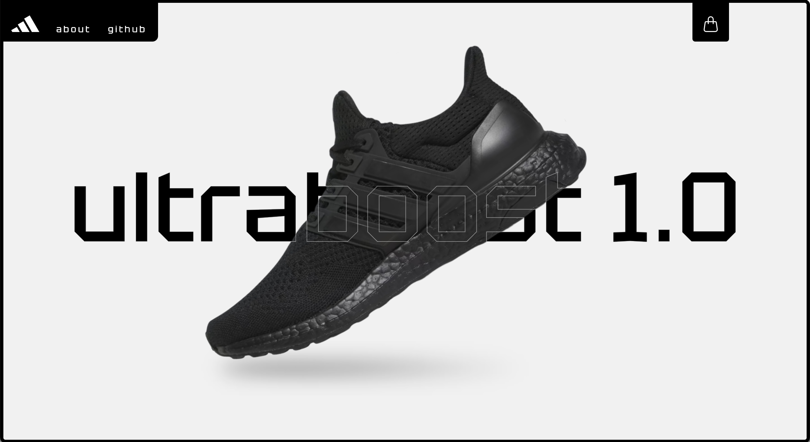
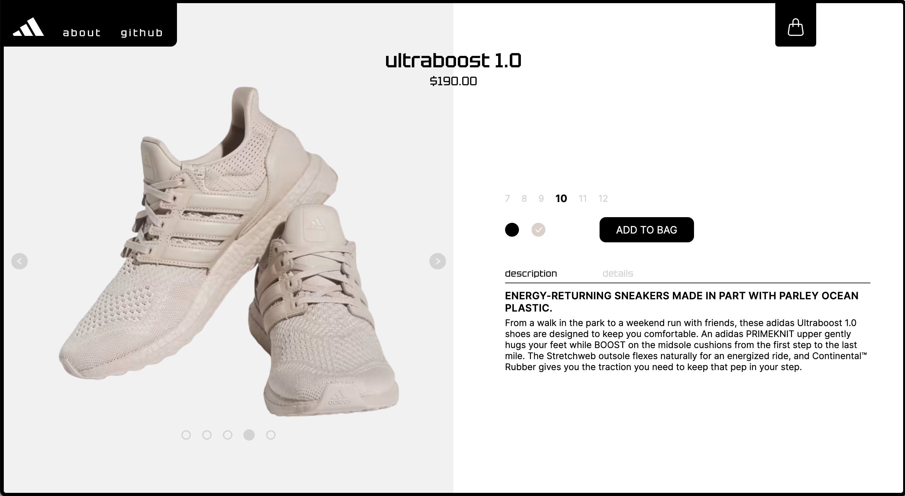
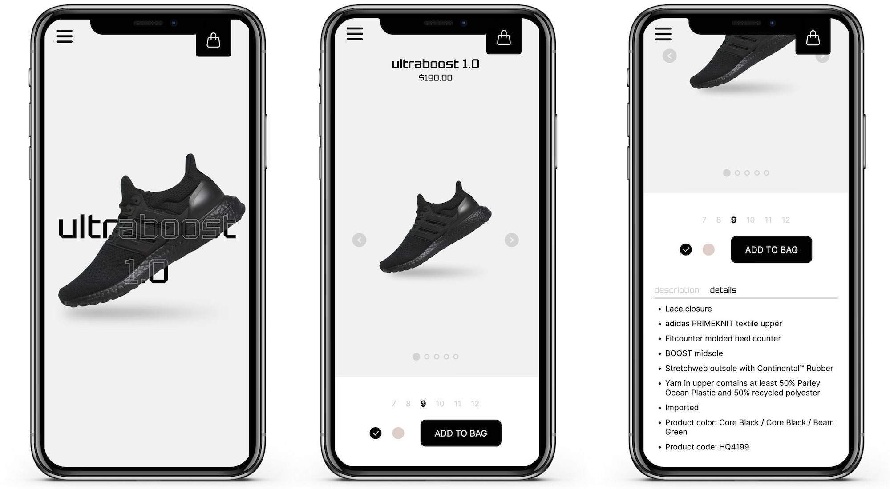
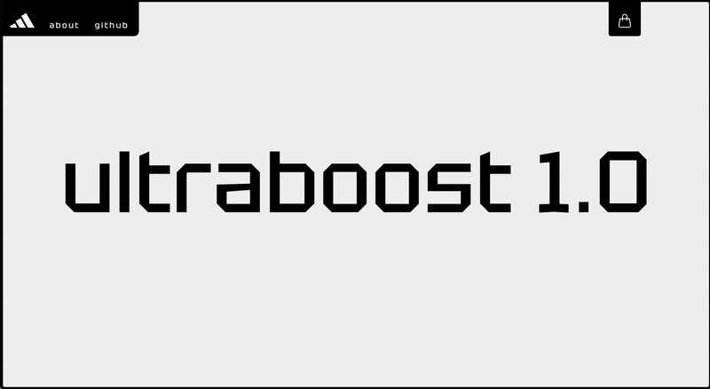
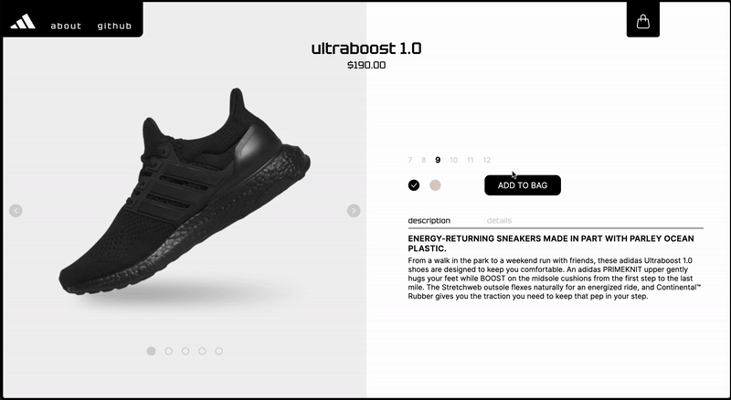

# 

# adidas ultraboost 1.0 Landing Page

<table>
<tr>
<td>
  I've built a responsive landing page for my portfolio using React, CSS, and TypeScript. It consists of two sections, Home page and Product page, has frontend cart functionality as well as animations powered by GSAP and Framer Motion.
</td>
</tr>
</table>

## Demo

Here is a working live demo hosted on Vercel: https://iharsh234.github.io/WebApp/

## Site

### Home Page

### Product Page

### Mobile views

## Interactivity

### Home Page & Image Slider

The image slider is built with JavaScript (no libraries).

### Pull-to-Open Cart Modal

The user drags down the UI's Cart Tab to reveal/hide the Cart modal. This is implemented with the use of GSAP's draggable interaction and elastic animation.

Every time an item is added to the screen, the Cart Tab animates, providing a visual hint as to what the user must do to open the Cart modal.

Last, the Cart icon changes if the cart is empty or not.

## Built with

- React
- CSS
- TypeScript
- GreenSock Animation Platform (GSAP)
- Framer Motion
